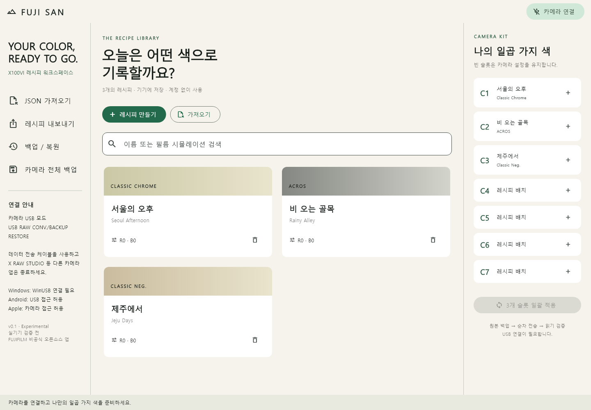
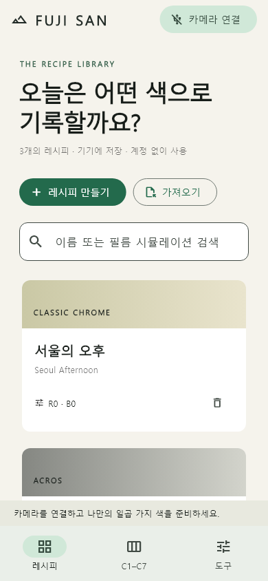

# Fuji San

설치해서 사용하는 **FUJIFILM X100VI 레시피 관리 앱**. Flutter로 Windows,
macOS, Android, iOS 화면을 공유하고 각 OS의 네이티브 USB API로 연결합니다.
브라우저, WebUSB, 계정, 서버가 필요하지 않습니다.





화면 예시의 레시피는 UI 검토용 데이터이며 앱에 기본 제공되는 검증된 레시피가 아닙니다.

> **Experimental 0.1 — 실기기 검증 전.** 레시피 관리, 네이티브 USB 연결 코드,
> 백업 및 검증을 포함한 일괄 쓰기가 구현되어 있습니다. 빌드 성공은 실제
> 카메라 호환성 검증을 의미하지 않습니다. 아직 모든 OS에서 전송이 검증된
> 완성품으로 배포하지 않습니다.

## 기능

- 한국어 네이티브 UI: 데스크톱 3열 / 모바일 하단 탐색
- 필름 시뮬레이션, WB, 톤, 그레인 등 레시피 편집 및 로컬 저장
- 자체 JSON v1 가져오기 / 클립보드 내보내기 (OFR·FP1 호환 아님)
- C1–C7 레시피 배치 및 선택 슬롯 일괄 적용
- 쓰기 전 해당 슬롯의 알려진 레시피 필드 백업을 디스크에 저장
- 카메라가 제공하는 자료형·허용 값 확인 및 쓰기 후 읽기 검증
- 실패 시 즉시 중단, 원본 백업을 통한 수동 복원
- 이미지 크기·화질 등 미확인 속성은 쓰지 않음

카드의 색상 띠는 장식이며 사진 결과를 시뮬레이션하지 않습니다.
백업은 앱이 다루는 레시피 설정 및 이름만 포함하며 카메라 전체 백업이 아닙니다.
사진, Wi-Fi, Bluetooth, RAW 렌더링, 커뮤니티 서버는 이 버전에 포함하지 않습니다.

## 플랫폼 및 연결

| 플랫폼 | 네이티브 연결 | 요구 사항 | 실기기 검증 |
|---|---|---|---|
| Windows | WinUSB + SetupAPI | PTP 인터페이스의 WinUSB 드라이버 | 미검증 |
| macOS | ImageCaptureCore | 카메라 접근 권한 | 미검증 |
| Android | USB Host API | OTG/USB Host, USB 접근 권한 | 미검증 |
| iOS / iPadOS 15.2+ | ImageCaptureCore | 카메라 제어 권한, 데이터 케이블/어댑터 | 미검증 |

1. X100VI USB 모드를 **USB RAW CONV./BACKUP RESTORE**로 설정합니다.
2. X RAW STUDIO, 사진 가져오기 등 다른 카메라 프로그램을 종료합니다.
3. 데이터 케이블로 연결하고 앱에서 **카메라 연결**을 누릅니다.
4. **카메라 전체 백업**으로 C1–C7의 레시피 설정을 먼저 보관합니다.
5. 테스트용 한 슬롯으로 쓰기·읽기·복원을 확인한 뒤 여러 슬롯으로 확장합니다.

Windows의 기본 사진 전송용 드라이버는 WinUSB와 다를 수 있습니다.
이 앱은 드라이버를 자동 변경하지 않습니다. WinUSB로 변경하면 해당 모드에서
기존 사진 전송 앱이 동작하지 않을 수 있으므로 현재 드라이버와 복구 방법을
확인한 뒤 카메라의 해당 인터페이스에만 적용해야 합니다.

한 번에 적용은 순차 작업이며 원자적 트랜잭션이 아닙니다. 전송 중 케이블이
분리되면 현재 슬롯이 부분 변경되고 앞선 슬롯은 완료되었을 수 있습니다.
재연결 후 백업 메뉴에서 복원하세요. 자동 롤백은 수행하지 않습니다.

## 개발

Flutter **3.47.6 stable**, Dart 3.13 이상. 플랫폼 빌드 도구는 별도 필요합니다.

```sh
flutter pub get
dart run tool/sync_apple.dart --check
flutter analyze
flutter test
flutter run -d windows   # Windows + Visual Studio C++ 도구
flutter run -d macos     # macOS + Xcode
flutter run             # 연결한 Android/iOS 기기 선택
```

Apple USB 공유 소스는 `native/apple/FujiUsb.swift`입니다. 수정 후
`dart run tool/sync_apple.dart`로 두 Runner 사본을 갱신합니다.

## 빌드 / 설치

[GitHub Actions](https://github.com/reikop/fuji-san/actions)에서 네 플랫폼을 빌드합니다.
성공한 실행의 Artifacts에서 결과를 받을 수 있습니다.

- Windows: Release 폴더 전체를 보관하고 `fuji_san.exe` 실행. 서명되지 않은 빌드.
- Android: 개발용 debug APK. 스토어 배포용 서명 아님.
- macOS: 서명·공증 없는 개발 빌드. 다운로드 후 로컬 서명 등이 필요할 수 있음.
- iOS: **서명 없는 컴파일 결과**. 바로 설치하는 IPA가 아니며 실기기 설치에는
  macOS/Xcode에서 개인 또는 개발자 팀 서명이 필요함. 계정 키는 저장소에 없음.

## 구조 및 데이터

`lib/domain` 레시피 검증 · `lib/camera` PTP/백업/일괄 쓰기 · `lib/storage.dart`
영속 저장 · `android` USB Host · `windows/runner/fuji_usb.cpp` WinUSB ·
`native/apple` ImageCaptureCore · `test` 프로토콜·실패 경로·화면 테스트.

설정은 애플리케이션 지원 폴더의 `fuji-san` 아래 보관합니다. 백업에는 연결된
카메라 시리얼 번호가 포함됩니다. 앱은 이를 업로드하지 않습니다.

MIT. 자료 출처 및 라이선스는 [THIRD_PARTY_NOTICES.md](THIRD_PARTY_NOTICES.md).
FUJIFILM과 무관한 독립 오픈소스 프로젝트입니다.
